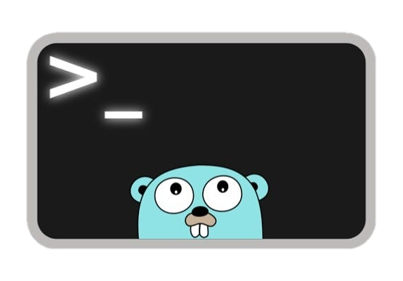

# LCME (Linux Content Management Engine)



[](https://github.com/GomdimApps/lcme/releases/)
[](https://pkg.go.dev/github.com/GomdimApps/lcme?tab=doc)


### **Propósito do Framework LCME**

O LCME é um framework projetado para facilitar a criação e gestão de conteúdo em aplicações web e aplicações de microserviços no Linux. Ele é leve e modular, permitindo que desenvolvedores integrem funcionalidades de gerenciamento de conteúdo de forma eficiente e escalável.

### **Objetivo do Framework**

O principal objetivo do LCME é fornecer uma solução simples e eficaz para o gerenciamento de conteúdo, com um foco especial em aplicações de microserviços desenvolvidas em Go. O projeto visa utilizar o mínimo de frameworks de terceiros, tornando a aplicação altamente nativa e reduzindo dependências externas.

### **Como o LCME Pode Ajudar em Projetos Go**

1. **Modularidade**: O framework é modular, o que significa que você pode escolher e integrar apenas os componentes que são necessários para o seu projeto, mantendo o sistema leve e eficiente.

2. **Escalabilidade**: Com uma arquitetura leve, o LCME permite que aplicações escalem de forma eficiente, suportando um aumento no volume de conteúdo sem comprometer o desempenho.

3. **Customização**: O LCME oferece uma alta capacidade de customização, permitindo que desenvolvedores adaptem o framework às necessidades específicas do projeto, seja na interface de usuário ou na lógica de backend.

4. **Natividade**: Ao minimizar o uso de frameworks de terceiros, o LCME garante que a aplicação permaneça altamente nativa, o que pode resultar em melhor desempenho e menor complexidade.

5. **Interação Nativa com Linux**: O LCME facilita o uso e a implementação de microserviços, trazendo maneiras nativas de interagir com o sistema operacional Linux (Server) dentro de uma aplicação, o que pode ser extremamente útil para operações de baixo nível e otimizações específicas do sistema.

6. **Documentação e Suporte**: O repositório inclui documentação detalhada e exemplos de uso, facilitando a curva de aprendizado e a implementação do framework em novos projetos.

## Como adicionar o Framework

```bash
go get github.com/GomdimApps/lcme
```

# Shell

Executa um comando Shell e retorna a saída padrão e um erro, se houver.

#### Parâmetros

- **`command`** (string): Comando Shell a ser executado.

#### Retornos

- **`string`**: Saída padrão do comando.
- **`error`**: Descrição do erro, se ocorrer.

#### Exemplo de Uso

```go
package main

import (
    "fmt"
    "github.com/GomdimApps/lcme"
)

func main() {
    comando := "rm -r teste.txt" // Comando a ser executado

    resultado, erro := lcme.Shell(comando)
    if erro != nil {
        fmt.Println("Erro:", erro) // Exibe erro, se houver
    } else {
        fmt.Println("Resultado:", resultado) // Exibe a saída do comando
    }
}
```

### Comportamento

- Retorna a saída do comando e `nil` se bem-sucedido.
- Retorna a saída e um erro descritivo se o comando falhar.

---

# ConfigRead

A função `ConfigRead` serve para carregar um arquivo de configuração (`config.conf`) e preencher a estrutura `Config` com os valores lidos. O arquivo de configuração deve seguir o formato `chave=valor`.

### Como Usar:

1. Crie um arquivo de configuração no formato adequado (ver abaixo).
2. Chame a função `ConfigRead` passando o caminho do arquivo e a estrutura `Config`.
3. A função preencherá os campos da estrutura com os valores do arquivo.

### Regras para o Arquivo de Configuração

- Cada linha do arquivo deve ter o formato `chave=valor`.
- O nome da chave deve ser exatamente igual ao nome do campo da estrutura `Config`, respeitando letras maiúsculas e minúsculas.
- Os valores devem ser compatíveis com o tipo de dado correspondente ao campo:
  - Para `bool`: Use `true` ou `false`.
  - Para `int`, `int64`, `uint64`: Use números inteiros.
  - Para `float32`, `float64`: Use números decimais (ponto `.` para separar a parte decimal).
  - Para `string`: Use qualquer sequência de texto sem espaços ao redor do valor.
  
- Comentários devem começar com o caractere `#` e serão ignorados.

### Exemplo da Estrutura `Config`

Abaixo está um exemplo de uma estrutura `Config` que pode ser usada com a função `ConfigRead`:

```go
type Config struct {
    AccessIp       bool
    MaxConnections int
    Port           int
    HostName       string
    Timeout        float64
    EnableLogs     bool
    ConnectionID   int64
    BufferSize     uint64
    ResponseTime   float32
}
```

#### Exemplo de arquivo `config.conf`:

```
# Configurações do servidor
AccessIp=true
MaxConnections=100
Port=8080
HostName=localhost
Timeout=30.5
EnableLogs=true
ConnectionID=1234567890
BufferSize=4096
ResponseTime=0.25
```

- **Chave**: Deve corresponder exatamente ao nome do campo na estrutura `Config`.
- **Valor**: Deve ser compatível com o tipo do campo (exemplo: `true` ou `false` para booleanos, números para inteiros e floats, etc.).

### Comando de Uso na `main`:

```go
package main

import (
    "fmt"
    "log"
    "github.com/GomdimApps/lcme" 
)

type Config struct {
    AccessIp       bool
    MaxConnections int
    Port           int
    HostName       string
    Timeout        float64
    EnableLogs     bool
    ConnectionID   int64
    BufferSize     uint64
    ResponseTime   float32
}

func main() {

    config := Config{}

    err := lcme.ConfigRead("config.conf", &config)
    if err != nil {
        log.Fatalf("Error loading configuration: %s", err)
    }

    fmt.Printf("AccessIp: %t\n", config.AccessIp)
    fmt.Printf("MaxConnections: %d\n", config.MaxConnections)
    fmt.Printf("Port: %d\n", config.Port)
    fmt.Printf("HostName: %s\n", config.HostName)
    fmt.Printf("Timeout: %.2f\n", config.Timeout)
    fmt.Printf("EnableLogs: %t\n", config.EnableLogs)
    fmt.Printf("ConnectionID: %d\n", config.ConnectionID)
    fmt.Printf("BufferSize: %d\n", config.BufferSize)
    fmt.Printf("ResponseTime: %.2f\n", config.ResponseTime)
}
```

# getInfoServer

A função `getInfoServer` é responsável por capturar diversas informações do sistema, como dados de distribuição Linux, memória, disco, CPU, e rede.


No seu código Go, importe o pacote `lcme` e chame a função `getInfoServer` para capturar as informações do servidor.

```go
package main

import (
	"fmt"
	"github.com/GomdimApps/lcme"
)

func main() {
	// Captura informações do servidor
	serverInfo := lcme.GetInfoServer()

	// Exibe os dados capturados
	fmt.Printf("Distribuição Linux: %s\n", serverInfo.Distribution.Name)
	fmt.Printf("Memória total: %d MB\n", serverInfo.RAM.Total)
	
}
```

---

### Tabela de Distribuição

| Campo                        | Tipo    | Descrição                                                                 |
|------------------------------|---------|---------------------------------------------------------------------------|
| `Distribution.PrettyName`     | `string`| Nome legível e completo da distribuição, geralmente inclui o nome e versão. |
| `Distribution.Name`           | `string`| Nome da distribuição, como "Debian GNU/Linux".                            |
| `Distribution.VersionID`      | `string`| ID da versão da distribuição (ex: "12").                                   |
| `Distribution.Version`        | `string`| Descrição da versão da distribuição, geralmente inclui número e nome codinome (ex: "12 (bookworm)"). |
| `Distribution.VersionCodeName`| `string`| Codinome da versão da distribuição, usado internamente (ex: "bookworm").  |
| `Distribution.ID`             | `string`| Identificador único da distribuição (ex: "debian").                       |
| `Distribution.HomeURL`        | `string`| URL do site principal da distribuição (ex: "https://www.debian.org/").    |
| `Distribution.SupportURL`     | `string`| URL para obter suporte técnico da distribuição (ex: "https://www.debian.org/support"). |
| `Distribution.BugReportURL`   | `string`| URL para reportar bugs da distribuição (ex: "https://bugs.debian.org/").  |

---

### Tabela de Memória RAM

| Campo              | Tipo    | Descrição                         |
|--------------------|---------|-----------------------------------|
| `RAM.Total`        | `uint64`| Memória RAM total em megabytes (MB). |
| `RAM.Used`         | `uint64`| Memória RAM usada em megabytes (MB). |
| `RAM.Available`    | `uint64`| Memória RAM disponível em megabytes (MB). |

---

### Tabela de Espaço em Disco

| Campo             | Tipo    | Descrição                         |
|-------------------|---------|-----------------------------------|
| `Disk.Total`      | `uint64`| Espaço total em disco em megabytes (MB). |
| `Disk.Used`       | `uint64`| Espaço em disco utilizado em megabytes (MB). |
| `Disk.Available`  | `uint64`| Espaço em disco disponível em megabytes (MB). |

---

### Tabela de CPU

| Campo              | Tipo      | Descrição                        |
|--------------------|-----------|----------------------------------|
| `CPU.NumCores`     | `int`     | Número total de núcleos do processador. |
| `CPU.Usage`        | `float64` | Percentual atual de uso do processador. |

---

### Tabela de Rede IPv4

| Campo                       | Tipo        | Descrição                                                   |
|-----------------------------|-------------|-------------------------------------------------------------|
| `Network.IPv4`               | `[]string`  | Lista de endereços IP IPv4 associados ao servidor.          |
| `Network.IPv4Ports.TCP.Out`  | `[]string`  | Endereços de saída (`OUT`) para conexões TCP em IPv4.       |
| `Network.IPv4Ports.TCP.In`   | `[]string`  | Endereços de entrada (`IN`) para conexões TCP em IPv4.      |
| `Network.IPv4Ports.TCP.All`  | `[]string`  | Conexões TCP completas em IPv4, exibe tanto os endereços de saída quanto de entrada. |
| `Network.IPv4Ports.UDP.Out`  | `[]string`  | Endereços de saída (`OUT`) para conexões UDP em IPv4.       |
| `Network.IPv4Ports.UDP.In`   | `[]string`  | Endereços de entrada (`IN`) para conexões UDP em IPv4.      |
| `Network.IPv4Ports.UDP.All`  | `[]string`  | Conexões UDP completas em IPv4, exibe tanto os endereços de saída quanto de entrada. |

---

### Tabela de Rede IPv6

| Campo                       | Tipo        | Descrição                                                   |
|-----------------------------|-------------|-------------------------------------------------------------|
| `Network.IPv6`               | `[]string`  | Lista de endereços IP IPv6 associados ao servidor.          |
| `Network.IPv6Ports.TCP.Out`  | `[]string`  | Endereços de saída (`OUT`) para conexões TCP em IPv6.       |
| `Network.IPv6Ports.TCP.In`   | `[]string`  | Endereços de entrada (`IN`) para conexões TCP em IPv6.      |
| `Network.IPv6Ports.TCP.All`  | `[]string`  | Conexões TCP completas em IPv6, exibe tanto os endereços de saída quanto de entrada. |
| `Network.IPv6Ports.UDP.Out`  | `[]string`  | Endereços de saída (`OUT`) para conexões UDP em IPv6.       |
| `Network.IPv6Ports.UDP.In`   | `[]string`  | Endereços de entrada (`IN`) para conexões UDP em IPv6.      |
| `Network.IPv6Ports.UDP.All`  | `[]string`  | Conexões UDP completas em IPv6, exibe tanto os endereços de saída quanto de entrada. |

---

### Tabela de Rede (NetworkRate)

| Campo                       | Tipo        | Descrição                                                   |
|-----------------------------|-------------|-------------------------------------------------------------|
| `Network.Download`          | `int64`     |  Taxa de download em kilobytes por segundo (KBps)           |
| `Network.Upload`            | `int64`     | Taxa de upload em kilobytes por segundo (KBps).             |


### Exemplos de Uso (NetworkRate)

```go
package main

import (
	"fmt"

	"github.com/GomdimApps/lcme"
)

func main() {
	serverInfo := lcme.GetInfoServer()

	fmt.Printf("Download: %d KB\n", serverInfo.Network.Download)
	fmt.Printf("Upload: %d KB\n", serverInfo.Network.Upload)

}
```

---

### Tabela de Hardware

| Campo                    | Tipo      | Descrição                           |
|--------------------------|-----------|-------------------------------------|
| `Hardware.KernelVersion`  | `string`  | Versão do kernel do sistema operacional. |
| `Hardware.ProcessorName`  | `string`  | Nome do processador do servidor.   |
| `Hardware.Uptime`         | `int`     | Tempo de execução do servidor em minutos. |
| `Hardware.SwapTotal`      | `int`     | Memória Swap total em megabytes (MB). |
| `Hardware.SwapFree`       | `int`     | Memória Swap disponível em megabytes (MB). |

---

### Exemplos de Uso

#### Exemplo 1: Capturar e Exibir Informações de Rede

```go
package main

import (
	"fmt"
	"github.com/GomdimApps/lcme"
)

func main() {
	serverInfo := lcme.GetInfoServer()

	// Exibir IPs IPv4
	for _, ip := range serverInfo.Network.IPv4 {
		fmt.Println("IP da máquina (IPv4):", ip)
	}

	// Exibir IPs IPv6
	for _, ip := range serverInfo.Network.IPv6 {
		fmt.Println("IP da máquina (IPv6):", ip)
	}
}
```

#### Exemplo 2: Capturar Informações de Memória

```go
package main

import (
	"fmt"
	"github.com/GomdimApps/lcme"
)

func main() {
	serverInfo := lcme.GetInfoServer()

	fmt.Printf("Memória total: %d MB\n", serverInfo.RAM.Total)
	fmt.Printf("Memória usada: %d MB\n", serverInfo.RAM.Used)
	fmt.Printf("Memória disponível: %d MB\n", serverInfo.RAM.Available)
}
```

---

# GetFolderSize

A função `GetFolderSize` é utilizada para calcular o tamanho de uma pasta específica em kilobytes (KB). Ela percorre recursivamente todos os arquivos e subdiretórios dentro do diretório especificado e soma o tamanho de cada arquivo.

### Parâmetros

- **`path`** (string): Caminho do diretório cuja soma dos tamanhos dos arquivos será calculada.

### Retornos

- **`uint64`**: Tamanho total da pasta em kilobytes (KB).
- **`error`**: Descrição do erro, se ocorrer. Se o usuário não tiver permissão para acessar algum arquivo ou diretório, um erro de permissão será retornado.

### Exemplo de Uso

```go
package main

import (
	"fmt"
	"github.com/GomdimApps/lcme"
)

func main() {
	size, err := lcme.GetFolderSize("/root")
	if err != nil {
		fmt.Printf("Error: %v\n", err)
	} else {
		fmt.Printf("Size of /root: %d KB\n", size)
	}
}
```

### Comportamento

- Retorna o tamanho total da pasta em kilobytes (KB) se bem-sucedido.
- Retorna um erro descritivo se ocorrer um problema ao acessar algum arquivo ou diretório, incluindo erros de permissão.

---

# GetFileInfo

A função `GetFileInfo` é utilizada para obter informações detalhadas sobre arquivos específicos em um diretório fornecido. Ela pode lidar tanto com a captura de informações de um único arquivo quanto de múltiplos arquivos. 

#### Parâmetros
- **`dir`** (string): O caminho do diretório onde os arquivos estão localizados.
- **`files`** (variadic string): Um ou mais nomes de arquivos para os quais as informações serão capturadas.

### Tabela de FileInfo

| Campo                | Tipo         | Descrição                                      |
|----------------------|--------------|------------------------------------------------|
| `FileName`           | `string`     | Nome do arquivo.                               |
| `FileSize`           | `int64`      | Tamanho do arquivo em bytes.                   |
| `FileLastChange`     | `time.Time`  | Data e hora da última modificação do arquivo.  |
| `FileUserPermisson`  | `os.FileMode`| Permissões do usuário no arquivo.              |
| `FileExtension`      | `string`     | Extensão do arquivo.                           |
| `FileData`           | `string`     | Conteúdo do arquivo em formato de string.      |
| `FileDataBuffer`     | `bytes.Buffer`| Buffer contendo os dados do arquivo.           |
| `FileDir`            | `string`     | Diretório onde o arquivo está localizado.      |

#### Exemplo de Uso

##### Capturar informações de um único arquivo:
```go
package main

import (
	"fmt"
	"github.com/GomdimApps/lcme"
)

func main() {
	fileInfos, err := lcme.GetFileInfo("/root", ".bashrc")
	if err != nil {
		fmt.Println("Error:", err)
		return
	}

	// Como estamos capturando apenas um arquivo, pegamos o primeiro elemento da lista
	fileInfo := fileInfos[0]
	fmt.Printf("FileName: %s\n", fileInfo.FileName)
	fmt.Printf("FileSize: %d KB\n", fileInfo.FileSize)
	fmt.Printf("FileLastChange: %s\n", fileInfo.FileLastChange)
	fmt.Printf("FileUserPermisson: %s\n", fileInfo.FileUserPermisson)
}
```

##### Capturar informações de múltiplos arquivos:
```go
package main

import (
	"fmt"
	"github.com/GomdimApps/lcme"
)

func main() {
	files := []string{".bashrc", "Dockerfile"}
	fileInfos, err := lcme.GetFileInfo("/root", files...)
	if err != nil {
		fmt.Println("Error:", err)
		return
	}

	for _, fileInfo := range fileInfos {
		fmt.Printf("FileName: %s\n", fileInfo.FileName)
		fmt.Printf("FileSize: %d KB\n", fileInfo.FileSize)
		fmt.Printf("FileLastChange: %s\n", fileInfo.FileLastChange)
		fmt.Printf("FileUserPermisson: %s\n", fileInfo.FileUserPermisson)
	}
}
```

Com essa função, você pode facilmente obter informações detalhadas sobre arquivos específicos em um diretório, seja para um único arquivo ou para múltiplos arquivos.

---

# Log

A função `Log` é projetada para registrar mensagens em um arquivo de log. Isso é útil para manter um registro das atividades ou eventos que ocorrem em um programa.

### Como Usar 

```go
package main

import (
    "github.com/GomdimApps/lcme"
)

func main() {
    succerlog := lcme.Log("log.txt")

    // Log messages
    succerlog("First log message")
    succerlog("Second log message")
    succerlog("Third log message")
}
```

### Passos para Usar a Função `Log`:

1. **Especificar o Caminho do Arquivo de Log:**
    ```go
    succerlog := lcme.Log("log.txt")
    ```
    Aqui, `lcme.Log("log.txt")` a função que adiciona mensagens ao arquivo `log.txt`.

2. **Registrar Mensagens no Arquivo de Log:**
    ```go
    succerlog("First log message")
    succerlog("Second log message")
    succerlog("Third log message")
    ```
    Cada chamada para `succerlog` adiciona uma nova linha ao arquivo `log.txt` com a mensagem fornecida.

# MonitorNetworkRates

A função `MonitorNetworkRates` é utilizada para monitorar continuamente as taxas de download e upload da interface de rede ativa. Ela retorna um canal através do qual as taxas de rede são enviadas periodicamente.

### Exemplo de Uso

```go
package main

import (
	"fmt"

	"github.com/GomdimApps/lcme"
)

func main() {
	ratesChannel := lcme.MonitorNetworkRates()

	for rate := range ratesChannel {

		fmt.Printf("Download: %d KB, Upload: %d KB\n", rate.Download, rate.Upload)

	}
}
```

---

# ScaleFork

A função `ScaleFork` é capaz de escalar a execução de uma tarefa, gerenciando sua execução.

### Exemplo de Uso

```go
package main

import (
	"fmt"

	"github.com/GomdimApps/lcme"
	// Ensure the threads package is imported
)

func main() {
	// Execute the task using the ScaleFork function
	lcme.ScaleFork(func() {
		// Simulate a long-running operation
		fmt.Println("Task completed")
	})
}
```

### Benefícios

Esta função oferece uma série de benefícios, especialmente para quem busca gerenciar e escalar o processamento de tarefas assíncronas. Aqui estão alguns dos principais benefícios:

1. **Escalabilidade:**
	- A função permite escalar dinamicamente o número de trabalhadores (workers) conforme a demanda de tarefas. Isso garante que o sistema possa lidar com picos de carga sem interrupções.

2. **Gerenciamento Eficiente de Tarefas:**
	- Usando goroutines, a função consegue executar várias tarefas em paralelo, o que aumenta a eficiência e a velocidade do processamento.

3. **Isolamento de Processos:**
	- A funcionalidade de bifurcação de processos (`ForkProcess`) e manipulação de memória (`WriteProcessMem`) permite criar cópias de processos e modificar dados de maneira controlada, o que é útil para testes e simulações.

### Exemplos de Uso

- **Processamento em Lote:** Ideal para sistemas que precisam processar grandes volumes de dados em lote, como sistemas de processamento de imagens ou análises de dados.
- **Sistema de Filas:** Pode ser usado como base para um sistema de filas onde diferentes tarefas precisam ser enfileiradas e executadas de forma assíncrona.
- **Aplicações Web:** Pode servir como um backend para aplicações web que necessitam de processamento em segundo plano, como envio de e-mails, notificações push, etc.
```

