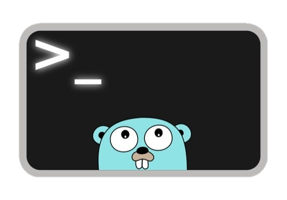

# LCME (Linux Content Management Engine)



[](https://github.com/GomdimApps/lcme/releases/)
[](https://pkg.go.dev/github.com/GomdimApps/lcme?tab=doc)

### **Purpose of the LCME Framework**

LCME is a framework designed to facilitate the creation and management of content in web applications and microservices applications on Linux. It is lightweight and modular, allowing developers to integrate content management functionalities efficiently and scalably.

### **Framework Objective**

The main objective of LCME is to provide a simple and effective solution for content management, with a special focus on microservices applications developed in Go. The project aims to use the minimum of third-party frameworks, making the application highly native and reducing external dependencies.

### **How LCME Can Help in Go Projects**

1. **Modularity**: The framework is modular, meaning you can choose and integrate only the components necessary for your project, keeping the system lightweight and efficient.

2. **Scalability**: With a lightweight architecture, LCME allows applications to scale efficiently, supporting an increase in content volume without compromising performance.

3. **Customization**: LCME offers a high degree of customization, allowing developers to adapt the framework to the specific needs of the project, whether in the user interface or backend logic.

4. **Nativism**: By minimizing the use of third-party frameworks, LCME ensures that the application remains highly native, which can result in better performance and lower complexity.

5. **Native Interaction with Linux**: LCME facilitates the use and implementation of microservices, bringing native ways to interact with the Linux operating system (Server) within an application, which can be extremely useful for low-level operations and system-specific optimizations.

6. **Documentation and Support**: The repository includes detailed documentation and usage examples, making it easier to learn and implement the framework in new projects.

## How to Add the Framework

```bash
go get github.com/GomdimApps/lcme
```

# Shell

Executes a Shell command and returns the standard output and an error, if any.

#### Parameters

- **`command`** (string): Shell command to be executed.

#### Returns

- **`string`**: Standard output of the command.
- **`error`**: Error description, if any.

#### Usage Example

```go
package main

import (
	"fmt"
	"github.com/GomdimApps/lcme"
)

func main() {
	command := "rm -r teste.txt" // Command to be executed

	result, err := lcme.Shell(command)
	if err != nil {
		fmt.Println("Error:", err) // Display error, if any
	} else {
		fmt.Println("Result:", result) // Display command output
	}
}
```

### Behavior

- Returns the command output and `nil` if successful.
- Returns the output and a descriptive error if the command fails.

---

# ConfigRead

The `ConfigRead` function is used to load a configuration file (`config.conf`) and populate the `Config` structure with the values read. The configuration file must follow the `key=value` format.

### How to Use:

1. Create a configuration file in the appropriate format (see below).
2. Call the `ConfigRead` function, passing the file path and the `Config` structure.
3. The function will populate the structure fields with the values from the file.

### Configuration File Rules

- Each line of the file must be in the `key=value` format.
- The key name must exactly match the field name in the `Config` structure, respecting case sensitivity.
- Values must be compatible with the corresponding field type:
  - For `bool`: Use `true` or `false`.
  - For `int`, `int64`, `uint64`: Use integer numbers.
  - For `float32`, `float64`: Use decimal numbers (dot `.` to separate the decimal part).
  - For `string`: Use any text sequence without spaces around the value.
  
- Comments must start with the `#` character and will be ignored.

### Example of the `Config` Structure

Below is an example of a `Config` structure that can be used with the `ConfigRead` function:

```go
type Config struct {
	AccessIp       bool
	MaxConnections int
	Port           int
	HostName       string
	Timeout        float64
	EnableLogs     bool
	ConnectionID   int64
	BufferSize     uint64
	ResponseTime   float32
}
```

#### Example of `config.conf` file:

```
# Server configurations
AccessIp=true
MaxConnections=100
Port=8080
HostName=localhost
Timeout=30.5
EnableLogs=true
ConnectionID=1234567890
BufferSize=4096
ResponseTime=0.25
```

- **Key**: Must exactly match the field name in the `Config` structure.
- **Value**: Must be compatible with the field type (e.g., `true` or `false` for booleans, numbers for integers and floats, etc.).

### Usage Command in `main`:

```go
package main

import (
	"fmt"
	"log"
	"github.com/GomdimApps/lcme" 
)

type Config struct {
	AccessIp       bool
	MaxConnections int
	Port           int
	HostName       string
	Timeout        float64
	EnableLogs     bool
	ConnectionID   int64
	BufferSize     uint64
	ResponseTime   float32
}

func main() {

	config := Config{}

	err := lcme.ConfigRead("config.conf", &config)
	if err != nil {
		log.Fatalf("Error loading configuration: %s", err)
	}

	fmt.Printf("AccessIp: %t\n", config.AccessIp)
	fmt.Printf("MaxConnections: %d\n", config.MaxConnections)
	fmt.Printf("Port: %d\n", config.Port)
	fmt.Printf("HostName: %s\n", config.HostName)
	fmt.Printf("Timeout: %.2f\n", config.Timeout)
	fmt.Printf("EnableLogs: %t\n", config.EnableLogs)
	fmt.Printf("ConnectionID: %d\n", config.ConnectionID)
	fmt.Printf("BufferSize: %d\n", config.BufferSize)
	fmt.Printf("ResponseTime: %.2f\n", config.ResponseTime)
}
```

# getInfoServer

The `getInfoServer` function is responsible for capturing various system information, such as Linux distribution data, memory, disk, CPU, and network.

In your Go code, import the `lcme` package and call the `getInfoServer` function to capture server information.

```go
package main

import (
	"fmt"
	"github.com/GomdimApps/lcme"
)

func main() {
	// Capture server information
	serverInfo := lcme.GetInfoServer()

	// Display captured data
	fmt.Printf("Linux Distribution: %s\n", serverInfo.Distribution.Name)
	fmt.Printf("Total Memory: %d MB\n", serverInfo.RAM.Total)
}
```

### Distribution Table

| Field                        | Type    | Description                                                                 |
|------------------------------|---------|---------------------------------------------------------------------------|
| `Distribution.PrettyName`     | `string`| Human-readable and complete name of the distribution, usually includes name and version. |
| `Distribution.Name`           | `string`| Name of the distribution, such as "Debian GNU/Linux".                            |
| `Distribution.VersionID`      | `string`| Version ID of the distribution (e.g., "12").                                   |
| `Distribution.Version`        | `string`| Description of the distribution version, usually includes number and codename (e.g., "12 (bookworm)"). |
| `Distribution.VersionCodeName`| `string`| Codename of the distribution version, used internally (e.g., "bookworm").  |
| `Distribution.ID`             | `string`| Unique identifier of the distribution (e.g., "debian").                       |
| `Distribution.HomeURL`        | `string`| URL of the distribution's main website (e.g., "https://www.debian.org/").    |
| `Distribution.SupportURL`     | `string`| URL for obtaining technical support for the distribution (e.g., "https://www.debian.org/support"). |
| `Distribution.BugReportURL`   | `string`| URL for reporting bugs in the distribution (e.g., "https://bugs.debian.org/").  |

---

### RAM Table

| Field              | Type    | Description                         |
|--------------------|---------|-----------------------------------|
| `RAM.Total`        | `uint64`| Total RAM in megabytes (MB). |
| `RAM.Used`         | `uint64`| Used RAM in megabytes (MB). |
| `RAM.Available`    | `uint64`| Available RAM in megabytes (MB). |

---

### Disk Space Table

| Field             | Type    | Description                         |
|-------------------|---------|-----------------------------------|
| `Disk.Total`      | `uint64`| Total disk space in megabytes (MB). |
| `Disk.Used`       | `uint64`| Used disk space in megabytes (MB). |
| `Disk.Available`  | `uint64`| Available disk space in megabytes (MB). |

---

### CPU Table

| Field              | Type      | Description                        |
|--------------------|-----------|----------------------------------|
| `CPU.NumCores`     | `int`     | Total number of processor cores. |
| `CPU.Usage`        | `float64` | Current processor usage percentage. |

---

### IPv4 Network Table

| Field                       | Type        | Description                                                   |
|-----------------------------|-------------|-------------------------------------------------------------|
| `Network.IPv4`               | `[]string`  | List of IPv4 addresses associated with the server.          |
| `Network.IPv4Ports.TCP.Out`  | `[]string`  | Outgoing (`OUT`) addresses for TCP connections in IPv4.       |
| `Network.IPv4Ports.TCP.In`   | `[]string`  | Incoming (`IN`) addresses for TCP connections in IPv4.      |
| `Network.IPv4Ports.TCP.All`  | `[]string`  | Complete TCP connections in IPv4, showing both outgoing and incoming addresses. |
| `Network.IPv4Ports.UDP.Out`  | `[]string`  | Outgoing (`OUT`) addresses for UDP connections in IPv4.       |
| `Network.IPv4Ports.UDP.In`   | `[]string`  | Incoming (`IN`) addresses for UDP connections in IPv4.      |
| `Network.IPv4Ports.UDP.All`  | `[]string`  | Complete UDP connections in IPv4, showing both outgoing and incoming addresses. |

---

### IPv6 Network Table

| Field                       | Type        | Description                                                   |
|-----------------------------|-------------|-------------------------------------------------------------|
| `Network.IPv6`               | `[]string`  | List of IPv6 addresses associated with the server.          |
| `Network.IPv6Ports.TCP.Out`  | `[]string`  | Outgoing (`OUT`) addresses for TCP connections in IPv6.       |
| `Network.IPv6Ports.TCP.In`   | `[]string`  | Incoming (`IN`) addresses for TCP connections in IPv6.      |
| `Network.IPv6Ports.TCP.All`  | `[]string`  | Complete TCP connections in IPv6, showing both outgoing and incoming addresses. |
| `Network.IPv6Ports.UDP.Out`  | `[]string`  | Outgoing (`OUT`) addresses for UDP connections in IPv6.       |
| `Network.IPv6Ports.UDP.In`   | `[]string`  | Incoming (`IN`) addresses for UDP connections in IPv6.      |
| `Network.IPv6Ports.UDP.All`  | `[]string`  | Complete UDP connections in IPv6, showing both outgoing and incoming addresses. |

---

### Network Rate Table

| Field                       | Type        | Description                                                   |
|-----------------------------|-------------|-------------------------------------------------------------|
| `Network.Download`          | `int64`     | Download rate in kilobytes per second (KBps).           |
| `Network.Upload`            | `int64`     | Upload rate in kilobytes per second (KBps).             |

### Usage Examples (Network Rate)

```go
package main

import (
	"fmt"

	"github.com/GomdimApps/lcme"
)

func main() {
	serverInfo := lcme.GetInfoServer()

	fmt.Printf("Download: %d KB\n", serverInfo.Network.Download)
	fmt.Printf("Upload: %d KB\n", serverInfo.Network.Upload)
}
```

### Hardware Table

| Field                | Type      | Description                           |
|----------------------|-----------|---------------------------------------|
| `Hardware.KernelVersion`  | `string`  | Kernel version of the operating system. |
| `Hardware.ProcessorName`  | `string`  | Name of the server processor.          |
| `Hardware.Uptime`         | `int`     | Server uptime in minutes.              |
| `Hardware.SwapTotal`      | `int`     | Total Swap memory in megabytes (MB).   |
| `Hardware.SwapFree`       | `int`     | Available Swap memory in megabytes (MB).|

---

### Usage Examples

#### Example 1: Capture and Display Network Information

```go
package main

import (
	"fmt"
	"github.com/GomdimApps/lcme"
)

func main() {
	serverInfo := lcme.GetInfoServer()

	// Display IPv4 addresses
	for _, ip := range serverInfo.Network.IPv4 {
		fmt.Println("Machine IP (IPv4):", ip)
	}

	// Display IPv6 addresses
	for _, ip := range serverInfo.Network.IPv6 {
		fmt.Println("Machine IP (IPv6):", ip)
	}
}
```

#### Example 2: Capture Memory Information

```go
package main

import (
	"fmt"
	"github.com/GomdimApps/lcme"
)

func main() {
	serverInfo := lcme.GetInfoServer()

	fmt.Printf("Total Memory: %d MB\n", serverInfo.RAM.Total)
	fmt.Printf("Used Memory: %d MB\n", serverInfo.RAM.Used)
	fmt.Printf("Available Memory: %d MB\n", serverInfo.RAM.Available)
}
```

---

# GetFolderSize

The `GetFolderSize` function is used to calculate the size of a specific folder in kilobytes (KB). It recursively traverses all files and subdirectories within the specified directory and sums the size of each file.

### Parameters

- **`path`** (string): Path of the directory whose total file sizes will be calculated.

### Returns

- **`uint64`**: Total size of the folder in kilobytes (KB).
- **`error`**: Error description, if any. If the user does not have permission to access any file or directory, a permission error will be returned.

### Usage Example

```go
package main

import (
	"fmt"
	"github.com/GomdimApps/lcme"
)

func main() {
	size, err := lcme.GetFolderSize("/root")
	if err != nil {
		fmt.Printf("Error: %v\n", err)
	} else {
		fmt.Printf("Size of /root: %d KB\n", size)
	}
}
```

### Behavior

- Returns the total size of the folder in kilobytes (KB) if successful.
- Returns a descriptive error if there is a problem accessing any file or directory, including permission errors.

---

# GetFileInfo

The `GetFileInfo` function is used to obtain detailed information about specific files in a given directory. It can handle capturing information for both a single file and multiple files.

### Parameters
- **`dir`** (string): The path of the directory where the files are located.
- **`files`** (variadic string): One or more file names for which information will be captured.

### FileInfo Table

| Field                | Type         | Description                                      |
|----------------------|--------------|--------------------------------------------------|
| `FileName`           | `string`     | Name of the file.                                |
| `FileSize`           | `int64`      | Size of the file in bytes.                       |
| `FileLastChange`     | `time.Time`  | Date and time of the last modification of the file. |
| `FileUserPermission` | `os.FileMode`| User permissions on the file.                    |
| `FileExtension`      | `string`     | File extension.                                  |
| `FileData`           | `string`     | Content of the file in string format.            |
| `FileDataBuffer`     | `bytes.Buffer`| Buffer containing the file data.                 |
| `FileDir`            | `string`     | Directory where the file is located.             |

### Usage Example

#### Capture information for a single file:
```go
package main

import (
	"fmt"
	"github.com/GomdimApps/lcme"
)

func main() {
	fileInfos, err := lcme.GetFileInfo("/root", ".bashrc")
	if err != nil {
		fmt.Println("Error:", err)
		return
	}

	// Since we are capturing only one file, we take the first element of the list
	fileInfo := fileInfos[0]
	fmt.Printf("FileName: %s\n", fileInfo.FileName)
	fmt.Printf("FileSize: %d KB\n", fileInfo.FileSize)
	fmt.Printf("FileLastChange: %s\n", fileInfo.FileLastChange)
	fmt.Printf("FileUserPermission: %s\n", fileInfo.FileUserPermission)
}
```

#### Capture information for multiple files:
```go
package main

import (
	"fmt"
	"github.com/GomdimApps/lcme"
)

func main() {
	files := []string{".bashrc", "Dockerfile"}
	fileInfos, err := lcme.GetFileInfo("/root", files...)
	if err != nil {
		fmt.Println("Error:", err)
		return
	}

	for _, fileInfo := range fileInfos {
		fmt.Printf("FileName: %s\n", fileInfo.FileName)
		fmt.Printf("FileSize: %d KB\n", fileInfo.FileSize)
		fmt.Printf("FileLastChange: %s\n", fileInfo.FileLastChange)
		fmt.Printf("FileUserPermission: %s\n", fileInfo.FileUserPermission)
	}
}
```

With this function, you can easily obtain detailed information about specific files in a directory, whether for a single file or multiple files.

---


# Log

The `Log` function is designed to record messages in a log file. This is useful for keeping a record of activities or events that occur in a program.

### How to Use

```go
package main

import (
	"github.com/GomdimApps/lcme"
)

func main() {
	logger := lcme.Log("log.txt")

	// Log messages
	logger("First log message")
	logger("Second log message")
	logger("Third log message")
}
```

### Steps to Use the `Log` Function:

1. **Specify the Log File Path:**
	```go
	logger := lcme.Log("log.txt")
	```
	Here, `lcme.Log("log.txt")` initializes the function to add messages to the `log.txt` file.

2. **Record Messages in the Log File:**
	```go
	logger("First log message")
	logger("Second log message")
	logger("Third log message")
	```
	Each call to `logger` adds a new line to the `log.txt` file with the provided message.

# MonitorNetworkRates

The `MonitorNetworkRates` function is used to continuously monitor the download and upload rates of the active network interface. It returns a channel through which the network rates are periodically sent.

### Usage Example

```go
package main

import (
	"fmt"

	"github.com/GomdimApps/lcme"
)

func main() {
	ratesChannel := lcme.MonitorNetworkRates()

	for rate := range ratesChannel {
		fmt.Printf("Download: %d KB, Upload: %d KB\n", rate.Download, rate.Upload)
	}
}
```

---

# ScaleFork

The `ScaleFork` function is capable of scaling the execution of a task, managing its execution.

### Usage Example

```go
package main

import (
	"fmt"

	"github.com/GomdimApps/lcme"
)

func main() {
	// Execute the task using the ScaleFork function
	lcme.ScaleFork(func() {
		// Simulate a long-running operation
		fmt.Println("Task completed")
	})
}
```

### Benefits

This function offers several benefits, especially for those looking to manage and scale the processing of asynchronous tasks. Here are some of the main benefits:

1. **Scalability:**
	- The function allows dynamically scaling the number of workers according to the task demand. This ensures the system can handle load spikes without interruptions.

2. **Efficient Task Management:**
	- Using goroutines, the function can execute multiple tasks in parallel, increasing efficiency and processing speed.

### Usage Examples

- **Batch Processing:** Ideal for systems that need to process large volumes of data in batches, such as image processing systems or data analysis.
- **Queue Systems:** Can be used as a basis for a queue system where different tasks need to be queued and executed asynchronously.
- **Web Applications:** Can serve as a backend for web applications that require background processing, such as sending emails, push notifications, etc.

---

# Compressing Files

This function compresses files in a simple and fast way.

### Usage Examples

```go
package main

import (
	"fmt"
	"log"

	"github.com/GomdimApps/lcme"
	// Ensure the threads package is imported
)

func main() {
	// ===== Example 1: Compressing a list of files =====
	files := []string{"file1.txt", "file2.txt"}
	zipFileForFiles := "./test/files.zip"
	tarGzFileForFiles := "./test/files.tar.gz"

	if err := lcme.ZipFiles(zipFileForFiles, files); err != nil {
		log.Println("Error compressing files into ZIP:", err)
	} else {
		fmt.Println("Files successfully compressed into ZIP!")
	}

	if err := lcme.TarGzFiles(tarGzFileForFiles, files); err != nil {
		log.Println("Error compressing files into TAR.GZ:", err)
	} else {
		fmt.Println("Files successfully compressed into TAR.GZ!")
	}

	// ===== Example 2: Compressing an entire folder =====
	folder := "./test"
	zipFileForFolder := "./test/folder.zip"
	tarGzFileForFolder := "./test/folder.tar.gz"

	if err := lcme.ZipFolder(zipFileForFolder, folder); err != nil {
		log.Println("Error compressing folder into ZIP:", err)
	} else {
		fmt.Println("Folder successfully compressed into ZIP!")
	}

	if err := lcme.TarGzFolder(tarGzFileForFolder, folder); err != nil {
		log.Println("Error compressing folder into TAR.GZ:", err)
	} else {
		fmt.Println("Folder successfully compressed into TAR.GZ!")
	}
}
```

```

